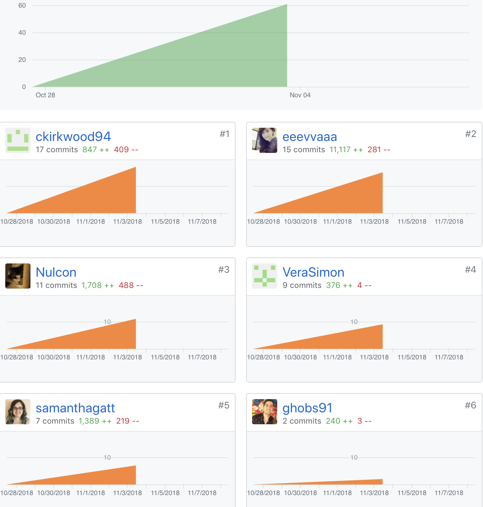

# Part One Individual Accomplishments this Week

GitHub Handle: ckirkwood94

On the frontend I set up the prettier pre-commit hook, so that it will format to code before committing the code. This week included a lot of research into python and Django. I helped with the backend deployment with Vera and Eva. I also worked on the user API endpoints. I worked on organizing the file structure of the backend as well.

# Front End

[Deployed here](https://anywhere-reader-test.netlify.com/)

- ### Ticket 1
  Github: [Pull Request](https://github.com/Lambda-School-Labs/Labs8-OfflineReader/pull/18)  
  Trello: [Implement Prettier](https://trello.com/c/cK5SyhKc/37-format-code-using-prettier-and-git-hooks)

# Back End

[Deployed here](https://anywhere-reader-test.herokuapp.com)

- ### Ticket 1
  Github: [Pull Request](https://github.com/Lambda-School-Labs/Labs8-OfflineReader/pull/29)  
  Trello: [API user endpoints (login, register, logout)](https://trello.com/c/0rfQc3jd/58-user-endpoints)
- ### Ticket 2
  Github:  
  Trello: [Deploy backend to Heroku](https://trello.com/c/u35yvOlR/51-deploy-backend-to-heroku)

### Detailed Analysis

One of the big blockers this week was definitely learning Python and Django. I had a lot of trouble trying to figure out best practices on top of learning a whole new language and web framework. This didn't stop me from working on the API user endpoints. I spent a couple hours looking for guides on how to set up endpoints and trying to decide which guide would be best to work with. I finally found a walk-through I could work with [here](https://wsvincent.com/django-rest-framework-user-authentication-tutorial/). Even though I could have spent 15-30 minutes following the walkthrough to get the endpoints set-up, I decided to really look into each step. I've learned a lot about the file structure, settings, imports, endpoints, and python in general from researching each step. It took me a long time to get everything working, but I learned a lot and it was worth it.

# Part Two Milestone Reflections

### Working as a team

I finally made it through the first week of Lambda Labs. I was not fully prepared mentally for what was to come this week. After working solo on many projects I have to overcome the differences of working in a team environment. While I made it through the first week I still have a lot to learn about working as a team.

### Postivity

It helps that as a team we keep things light-hearted and are continuously encouraging eachother. This helps a lot, because I feel as though we are already our own worse critic. We need others to offer constructive-criticism and learn from eachother to be successful.

### Live and learn

I realize that I probably didn't speak up or communicate enough this past week and feel as though I was struggling with coming up with tasks to complete. I know I spent a lot of time on learning python and Django - I still need to dive more into PostgreSQL - but I'm determined to learn from this past week and continue working hard.
