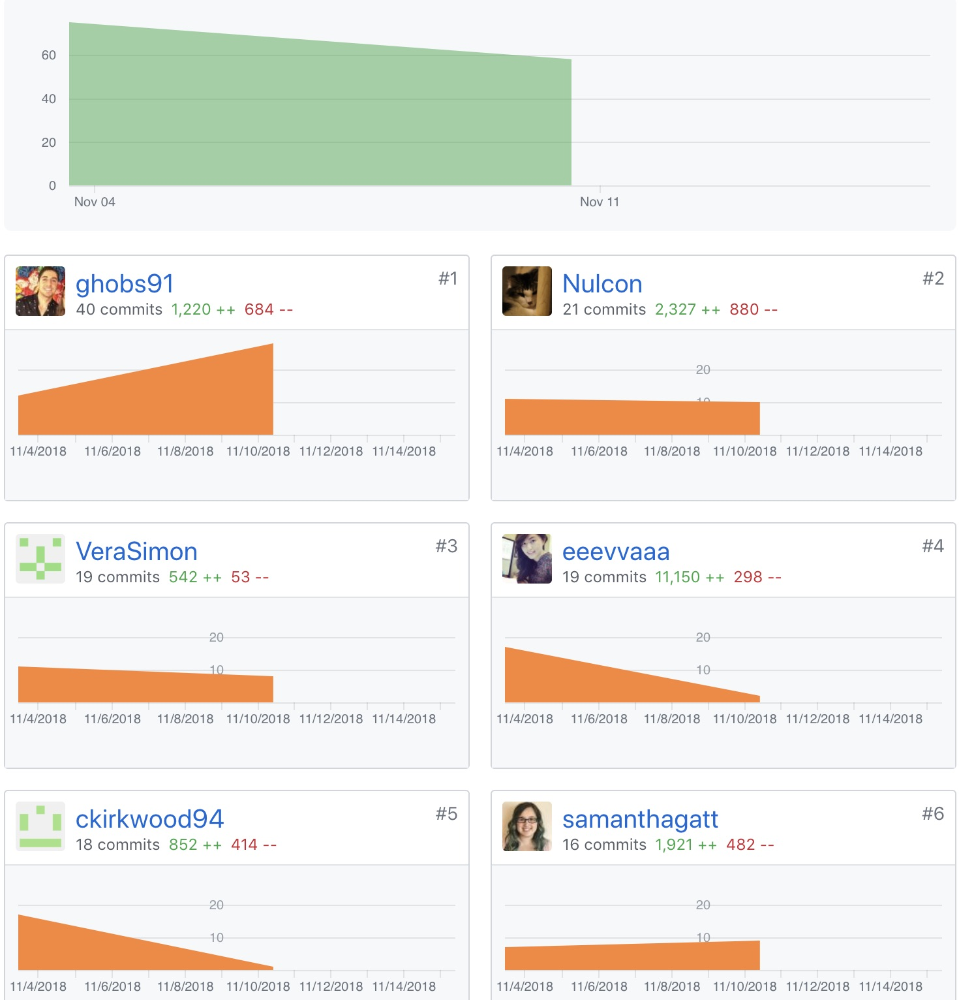
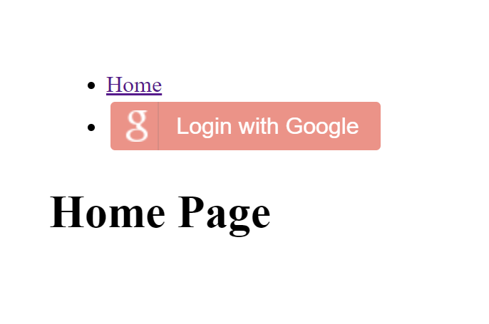
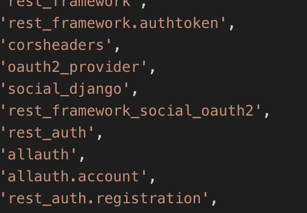

# Part One Individual Accomplishments this Week

GitHub Handle: ckirkwood94

I spent a lot of time on authenticating with Facebook and feel as though I'm really close. I believe I just need to figure out how to get the backend communicating with the frontend. I also helped Eva with getting the articles endpoints for POST and GET set up. We had a bug in the beginning of the week that prevented us from running a development server. Spent some time as a team trying to figure out what was wrong. After hearing how difficult Facebook can be to work with Andrew and I decided to tackle authenticating with Google hoping it would be easier. While we made progress it is still incomplete.

# Front End

[Deployed here](https://anywhere-reader-test.netlify.com/)

- ### Ticket 1
  Github: [Pull Request](https://github.com/Lambda-School-Labs/Labs8-OfflineReader/pull/51)  
  Trello: [Work with Andrew on frontend Google auth](https://trello.com/c/PQv17MIH/65-implement-oauth-or-another-approved-third-party-authentication-system)

# Back End

[Deployed here](https://anywhere-reader-test.herokuapp.com)

- ### Ticket 1
  Github: [Pull Request](https://github.com/Lambda-School-Labs/Labs8-OfflineReader/pull/51)  
  Trello: [Work with Andrew on backend Google auth)](https://trello.com/c/PQv17MIH/65-implement-oauth-or-another-approved-third-party-authentication-system)
- ### Ticket 2
  Github: [Pull Request](https://github.com/Lambda-School-Labs/Labs8-OfflineReader/pull/50)
  Trello: [Work on Facebook backend](https://trello.com/c/PQv17MIH/65-implement-oauth-or-another-approved-third-party-authentication-system)
- ### Ticket 3
  Github: [Pull Request](https://github.com/Lambda-School-Labs/Labs8-OfflineReader/pull/45)
  Trello: [Work with Eva on articles endpoints](https://trello.com/c/jPkBbuV6/74-pages-api)
- ### Ticket 4
  Github: [Pull Request](https://github.com/Lambda-School-Labs/Labs8-OfflineReader/pull/35)
  Trello: [Work with team on bug preventing dev server from launching](https://trello.com/c/RiyoyRZL/64-blocking-url-parameter-in-urlspy-is-preventing-dev-server-from-launching)

### Detailed Analysis

I spent a good portion of the week working on logging in with Facebook. And feel as though I'm close.

But after hearing how difficult Facebook can be we decided to see if we could get Google authentication working. We we're able to get a button displaying on out page.

We're trying everything we can to get some sort of third-party authentication going. I currently have a mix of different auth packages to try and get authentication up and running.

# Part Two Milestone Reflections

### Integration

Integration did not go as smoothly as it could have and is still incomplete. We got stuck with making some pull requests to big which caused conflicts with what others were working on. The whole team is working hard to accomplish the task, but we're still struggling. Stripe API is close to being finished. We're just having a communication problem between frontend and backend. Google authentication is close to being completed. Just seem to have a few more steps to walk through to get it fully implemented. We're stepping on others toes with the work we're completing and that is also impeding progress.
