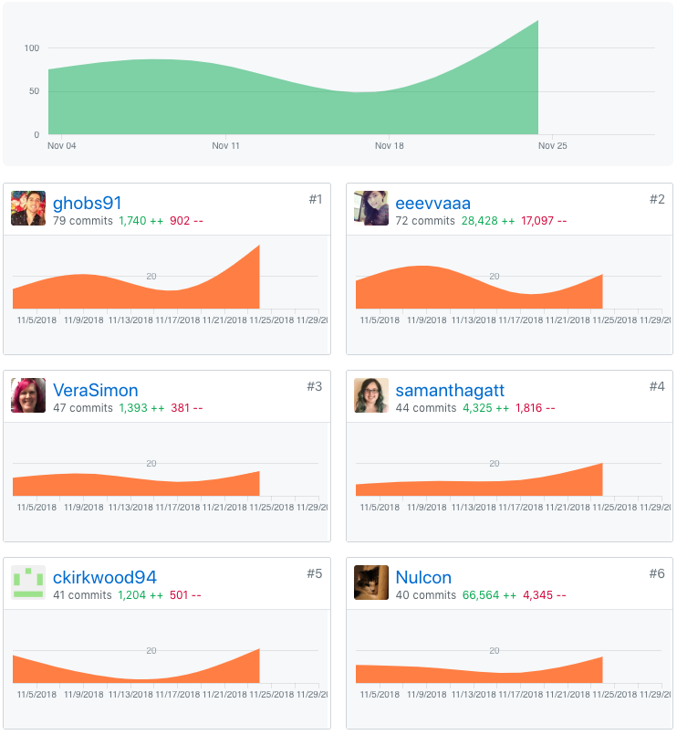
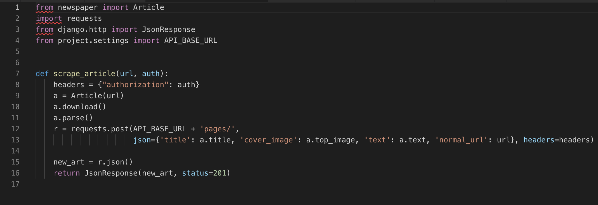
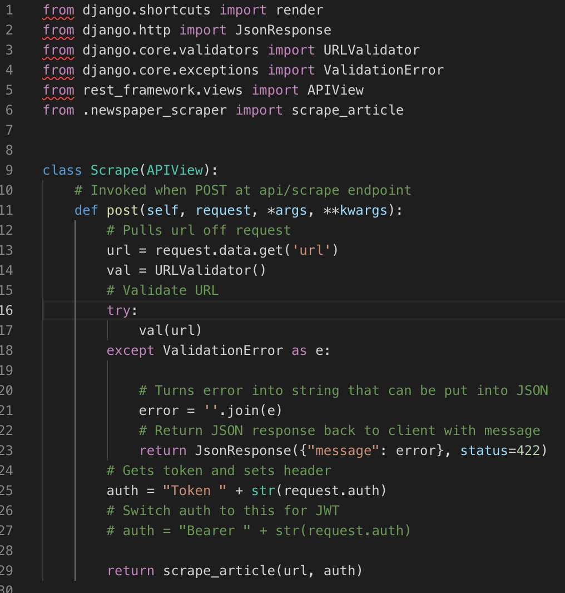
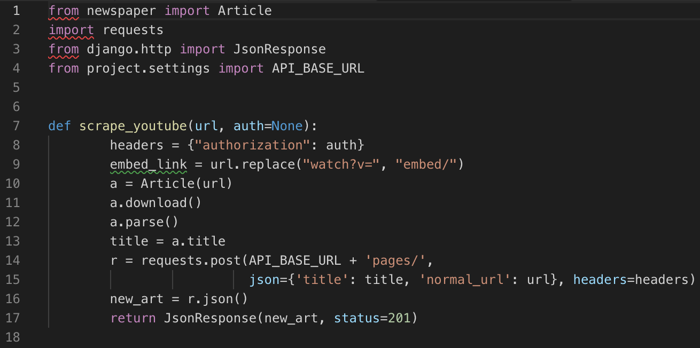

# Part One Individual Accomplishments this Week

<!-- [White board session]() -->

GitHub Handle: ckirkwood94

This week was a very stressful week. While I accomplished quite a bit on the backend scraper wise, my team and I were still struggling with authentication. I believe we're close and just a few steps away. I completed the article scraper and the youtube scraper is mostly done. I've been working on authentication again this week, but haven't had any breakthroughs.

# Front End

[Deployed here](https://anywhere-reader-test.netlify.com/)

- ### Ticket 1
  Github: [Pull Request](https://github.com/Lambda-School-Labs/Labs8-OfflineReader/pull/93)  
  Trello: [Frontend bug fix, cards constantly rotating (No Trello Card)]()

# Back End

[Deployed here](https://anywhere-reader-test.herokuapp.com)

- ### Ticket 1
  Github: [Pull Request](https://github.com/Lambda-School-Labs/Labs8-OfflineReader/pull/85)  
  Trello: [Scraper pull title, text and top image for articles](https://trello.com/c/sGYUM8m3/137-scraper-retrieve-html-contents-of-webpage)
- ### Ticket 2
  Github: [Pull Request](https://github.com/Lambda-School-Labs/Labs8-OfflineReader/pull/85)  
  Trello: [URL validator for scraper](https://trello.com/c/8PdfWidY/172-scraper-add-url-validation)
- ### Ticket 3
  Github: [Pull Request](https://github.com/Lambda-School-Labs/Labs8-OfflineReader/pull/92)  
  Trello: [Bug fix for what scraper was posting to database for articles (No Trello Card)]()
- ### Ticket 4
  Github: [Pull Request](https://github.com/Lambda-School-Labs/Labs8-OfflineReader/pull/80)  
  Trello: [Work with team on bug preventing heroku from working (No Trello Card)]()

### Detailed Analysis

I spent most of my time this week on scraper functionality and with Vera and Eva trying to figure out the authentication. Anyways with the scraper I ended starting with the article scraper. Pretty simple and straight forward - especially with the python library Conner found called Newspaper. Newspaper handles majority of the scraping for us and is able to return what we need with minimal code. Just take a look at this:

After getting a function I could run a URL through and retrieve the title, text, and top image of an article I started working on the function that would receive the request through an endpoint. When first starting out a lot of the variables were hard-coded in for testing purposes. I wanted to make sure data was flowing correctly without having to make requests to the endpoints all the time. Here we have the function the initializes the scraper.

This function starts with receiving a request through an endpoint from the frontend. It then pulls the URL off of the request and runs it through a validator to make sure it's a properly formatted URL. If it isn't it sends a message saying so. After validating it pulls the header off the request, so it can pass it through to the next function to make a request to POST to the database. After these steps it sends the URL and header to the next function.

Before spending the last 2 days of the week trying to figure out authentication - I had time to start on the Youtube scraper. I had a hard time trying to figure out how I was going to pull the items I needed due to the fact Youtube loads majority of their content with Javascript and not HTML. The tools I'm working with only really work with HTML. Fortunately Newspaper is still able find the title of the video. While I did spend a fair amount of time googling and trying to navigate Youtubes HTML I figured out that it's most likely not necessary to pull all the info from the HTML.

  
The Youtube is still a work in progress, but I am able to modify the URL of the Youtube video into an embed link and should be able to structure HTML to be able to embed the video into another site. All I need to figure out is how exactly I want to store the Youtube page in the database.

# Part Two Milestone Reflections

### Functionality

Our groups project is coming along. Majority of the project is backend oriented with very little on the frontend. Therefore we've been focused a lot on the backend. We were able to split up tasks as needed pretty successfully. Andrew was able to get a list of articles displayed on the webpage. Vera is getting really close with the authentication. Eva was able to structure the database tables. And I was able to work on the scraper.

We were more focused on functionality this week rather than trying to get the front end look pretty, or structured There's a lot to go into the backend and all that is required from the frontend is a sleek minimalistic feel with very few pages. We are still having challenges with authentication and it took up a lot of our time. We also had a few hiccups this week with bugs, but none too major.  
[Article scraper](https://github.com/Lambda-School-Labs/Labs8-OfflineReader/pull/85)  
[CRUD endpoints for articles](https://github.com/Lambda-School-Labs/Labs8-OfflineReader/pull/84)  
[Creates list of pages on frontend](https://github.com/Lambda-School-Labs/Labs8-OfflineReader/pull/80)  
[Model for storing articles on database](https://github.com/Lambda-School-Labs/Labs8-OfflineReader/pull/79)  
[Google auth on the frontend](https://github.com/Lambda-School-Labs/Labs8-OfflineReader/pull/78)
