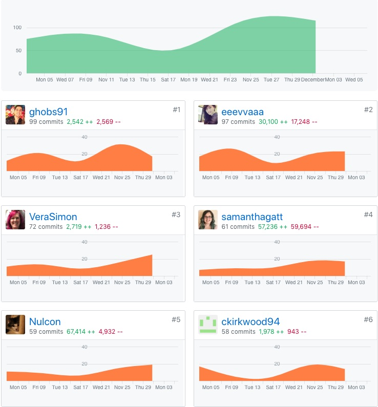
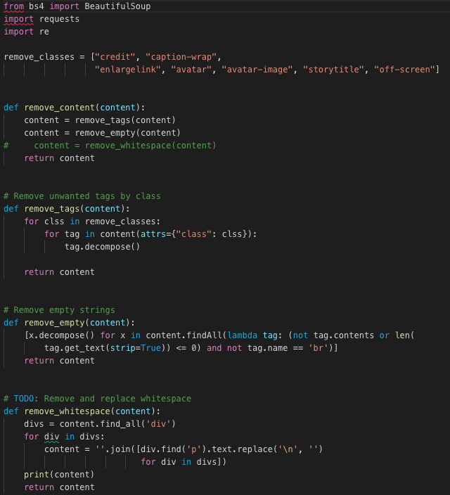
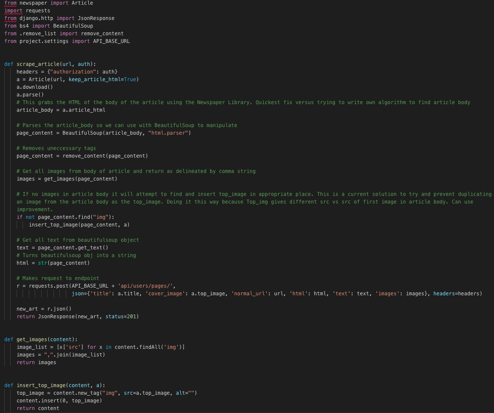
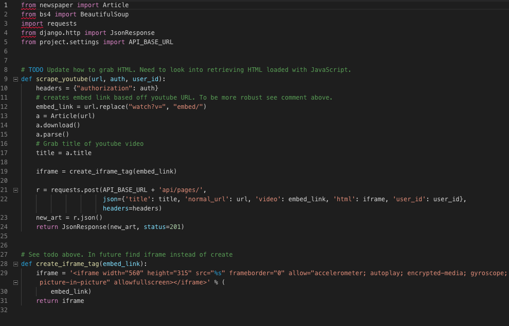
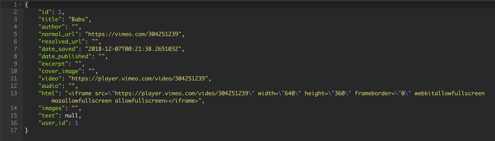

# Part One Individual Accomplishments this Week

[White board session](https://youtu.be/wYikkxUG1aM)

GitHub Handle: ckirkwood94

This week was once again a stressful week. We split up the task, so that one person was mainly focused on the UI while the rest of us were working on additional features and debugging. The UI is simple and clean. We still have a ways to go on the backend, because of how heavy our app is on the backend versus the frontend.

# Front End

[Deployed here](https://anywhere-reader-test.netlify.com/)

- ### Ticket 1
  Github: [Pull Request](https://github.com/Lambda-School-Labs/Labs8-OfflineReader/pull/99)  
  Trello: [Settings frontend component](https://trello.com/c/Tg2xDo3n/181-settings-frontend-view)

# Back End

[Deployed here](https://anywhere-reader-test.herokuapp.com)

- ### Ticket 1
  Github: [Pull Request](https://github.com/Lambda-School-Labs/Labs8-OfflineReader/pull/104)  
  Trello: [Facebook auth for backend](https://trello.com/c/k68M21LC/228-fb-oauth2-backend)
- ### Ticket 2
  Github: [Pull Request](https://github.com/Lambda-School-Labs/Labs8-OfflineReader/pull/123)  
  Trello: [Update article scraper](https://trello.com/c/P4Hj2kLm/212-scraper-general-article-scraper)
- ### Ticket 3
  Github: [Pull Request](https://github.com/Lambda-School-Labs/Labs8-OfflineReader/pull/127)  
  Trello: [Youtube and Vimeo scraper](https://trello.com/c/1SarTZOu/213-scraper-youtube)

### Detailed Analysis

This week I spent majority of my time on the scraper again. I did figure out Facebook auth for the backend and added the settings component to the front end as well. I started on modifying the article scraper, because we decided we wanted to return HTML to the frontend instead of just the text. I had to figure out a way of removing unnecessary tags from the article body. This is what I came up with. I still need to work on removing whitespace from the article, so that I can add in my own.

I also needed to continue returning text for the iOS team while returning HTML for the web app. There was some work that needed to be done so that the cover image wasn't also included in the article body. The solution I came up with is not perfect and that is because the top_image and the first image of the article body could be the same image, but have different `src` atttributes. There was also an issue of trying to figure out how to store HTML in a json object, but fortunately BeautifulSoup has a way to convert HTML to a string with escape characters.

I eventually started to get frustrated with the article scraper and decided I had enough for now and would revisit it later. I then started working on the Youtube scraper again and finished that up. I then added a scraper for Vimeo, which looks very similar to the Youtube scraper, although there are a few differences, so it couldn't be done by the same function.

When the scraper is done doing its thing it sends pack a JSON object with the following information:

# Part Two Milestone Reflections

### Presentation

Our group still has quite a bit of work to be done on the backend with various bugs and features. While many of the required features are there - there are still a lot of improvements to be made. We've been focused on putting out fires on the backend that I haven't been able to focus on the frontend that much. Vera has been helping out with the backend as well trying to figure out some issues we have with the articles for specific users. Vera has also been making progress on styling the frontend. We still need to work on styling for the frontend and bug fixes all around
