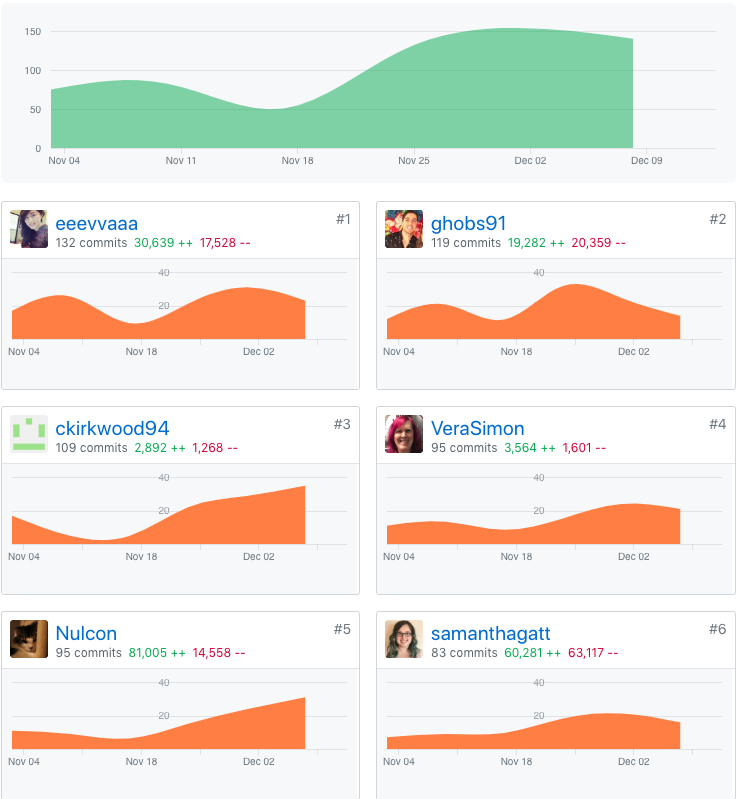
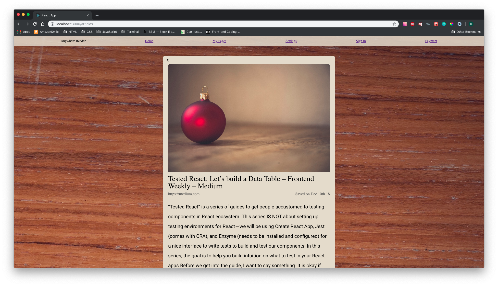
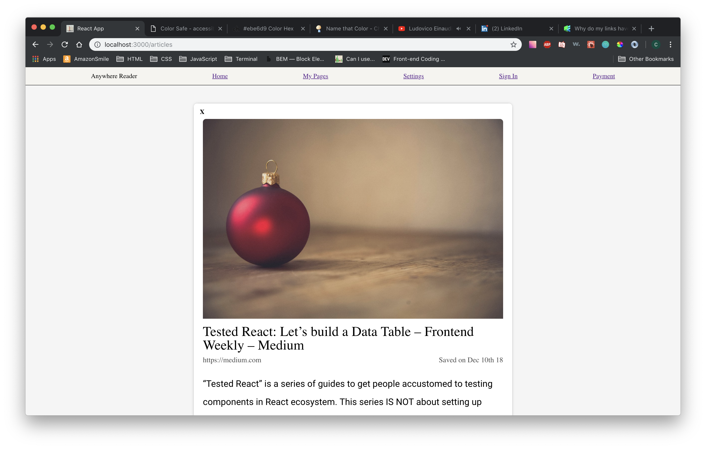
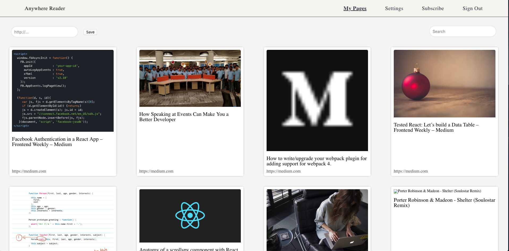

# Part One Individual Accomplishments this Week

GitHub Handle: ckirkwood94

This is the final week until we get a change order for the web app. This week I completed styling for the article modal and page list views. I also updated styling for the navigation. I added a search functionality to the frontend. I completed a basic scraper for bandcamp.

# Front End

[Deployed here](https://anywhere-reader-test.netlify.com/)

- ### Ticket 1

  Github: [Pull Request](https://github.com/Lambda-School-Labs/Labs8-OfflineReader/pull/174)  
  Trello: [Search article titles](https://trello.com/c/2lnFmakv/279-search-articles-functionality)

- ### Ticket 2

  Github: [Pull Request](https://github.com/Lambda-School-Labs/Labs8-OfflineReader/pull/165)  
  Trello: [Page list styling](https://trello.com/c/MvMQUQto/253-page-list-styling)

- ### Ticket 3

  Github: [Pull Request](https://github.com/Lambda-School-Labs/Labs8-OfflineReader/pull/164)  
  Trello: [Bug fix for active link on nav bar](https://trello.com/c/giideZBP/280-bug-fix-navigation-active-link)

- ### Ticket 4
  Github: [Pull Request](https://github.com/Lambda-School-Labs/Labs8-OfflineReader/pull/155)  
  Trello: [Article modal styling](https://trello.com/c/PdDKsYvu/242-article-modal-styling)

# Back End

[Deployed here](https://anywhere-reader-test.herokuapp.com)

- ### Ticket 1

  Github: [Pull Request](https://github.com/Lambda-School-Labs/Labs8-OfflineReader/pull/175)  
  Trello: [Bandcamp scraper](https://trello.com/c/ysrH2nKc/281-scraper-bandcamp-scraper)

- ### Ticket 2
  Github: [Pull Request](https://github.com/Lambda-School-Labs/Labs8-OfflineReader/pull/177)  
  Trello: [Bug fix for article scraper (No trello card)]()

### Detailed Analysis

This week I spent majority of my time on styling the frontend. I didn't really know what direction to take it. I ended up taking a stab in the dark at it and here is my original styling idea for the article modal:

While I personally liked this idea. Some other team members had other suggestions. We discussed why not to use a backgorund image and talked about an direction to take to color scheme. Eva and I eventually got together to try and brainstorm some ideas. Eva gave me an idea for some colors to use and here is what I came up with.

The team liked the simplicity and the color scheme. After finally deciding on how we wanted the web app to look styling became mush simpler. Next I started working on the page list view.

As you can see from the two previous screenshots the navigation bar also got an update. That pretty much concludes the styling I completed this week. Eva did a great job with the other pages.

# Part Two Milestone Reflections

### The Lambda Labs Experience

Finally week five is coming to a close. It's been a long, arduous journey. Overall working with the team I was assigned to was good. We were definitely lacking in knowledge about our tech stack at the beginning, because half of the stack we haven't used before. Even though we were lacking experience with Django, Python, and PostgreSQL we still pulled of the app with minimal bugs. The team kept things very optimistic even when we were a week behind. There was a time when we were arguably two weeks behind schedule. We continued working hard through out all five weeks.

The one thing that gave us the most trouble was authentication. It took 2-3 weeks of Vera and my time to try and get it working properly. This was due to unfamiliarity with Django and how to do auth with it. We had a custom user login prepared, but needed to get a third party authentication working with it and that is what was preventing us from completing authentication.

Another difficult task was offline storage. Andrew was working on it for a long time, but he was also dealing with buggy code that somehow got into his local codebase. The buggy code was preventing him from doing testing of the offline storage for a long while.

The scraper was another difficult challenge. While scraping websites is easy. Trying to come up with a general use scraper that correctly scrapes only the content you want is very difficult. There are a lot of improvements that need to be made with the scraper, but it works!

### The Project

Our teams tech stack for this project was React, Redux, Python, Django, PostgreSQL.

We used this tech stack to create a web application that would allow an user to store articles and different media. The point was not only just store, but remove all of the extra content on a page that wasn't part of the content. We would then allow the user to store these articles for offline use as well.

[Link to wiki for media used in the project](https://github.com/Lambda-School-Labs/Labs8-OfflineReader/wiki/Media-Licenses)
